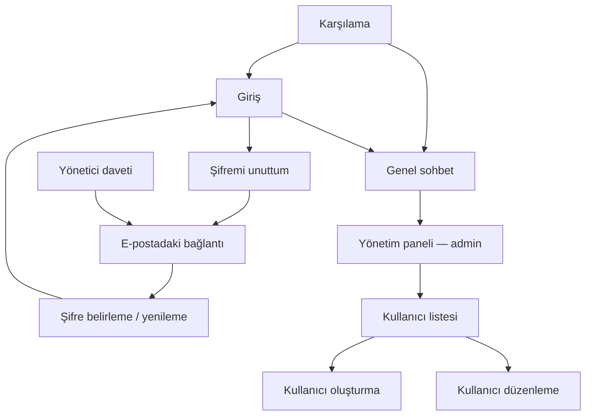

# TEPENET İletişim — Mevcut Ön Yüz ve Tasarım Envanteri

**İnceleme tarihi:** 8 Ekim 2026  
**Amaç:** Mevcut uygulamanın ekranlarını, öğelerini, etkileşimlerini ve görsel yapısını tasarım çalışmalarına aktarılabilecek şekilde açıklamak.

Bu belge mevcut kaynak kod ve route tanımları incelenerek hazırlanmıştır. Yeni bir tasarım önerisinin uygulanması anlamına gelmez. Ekran görüntüsü, canlı tarayıcı incelemesi veya gerçek cihaz ölçümü içermez. Görsel değerlendirmeler bileşenlerin yerleşim ve stil tanımlarına dayanır. Limitler için mevcut config dosyasındaki varsayılanlar belirtilmiştir; ortam ayarları farklı olabilir.

## 1. Tasarım aracına aktarılacak kısa ürün özeti

TEPENET İletişim, şirket çalışanlarının tek bir ortak **Genel** kanalında mesajlaştığı Türkçe bir web uygulamasıdır. Günlük kullanımın merkezi sohbet ekranıdır. Yönetici ayrıca kullanıcı hesaplarını oluşturur, düzenler, aktif/pasif yapar ve davet veya şifre bağlantısı gönderir.

Ön yüzde **8 Vue sayfa dosyası ve 9 ekran akışı** vardır. Kullanıcı oluşturma ve düzenleme aynı sayfa bileşenini kullanır. Ekranlar: karşılama, giriş, şifremi unuttum, şifre belirleme/yenileme, sohbet, yönetim paneli, kullanıcı listesi, kullanıcı oluşturma ve kullanıcı düzenleme.

Mevcut görünüm açık renkli, sade ve kart ağırlıklıdır: çok açık gri arka plan, beyaz yüzeyler, teal/turkuaz ana renk, koyu metinler, ince kenarlıklar, yuvarlatılmış köşeler ve küçük gölgeler. Marka çoğunlukla **TEPENET** yazısıyla temsil edilir. Ana uygulamada üst menü vardır; sidebar yoktur. Sohbet, ortalanmış bir sütunda sağ/sol mesaj balonları ve altta mesaj yazma alanından oluşur.

Tasarım güncellemesinde mevcut işlevler esas alınmalıdır. Daha dolu bir görünüm için eklenen örnek öğelerin yeni backend özellikleri gerektirip gerektirmediği açıkça ayrılmalıdır. Örneğin çevrimiçi kişi listesi, dosya eki, özel mesajlar veya bildirim merkezi mevcut ürünün bir parçası değildir.

## 2. Sayfa haritası ve erişim

| Ekran                      | Route yolu                 | Sayfa bileşeni                               | Kim kullanabilir?                                 |
| -------------------------- | -------------------------- | -------------------------------------------- | ------------------------------------------------- |
| Karşılama                  | `/`                        | `resources/js/pages/Welcome.vue`             | Misafir ve oturum açmış kullanıcı                 |
| Giriş                      | `/login`                   | `resources/js/pages/Auth/Login.vue`          | Misafir                                           |
| Şifremi unuttum            | `/forgot-password`         | `resources/js/pages/Auth/ForgotPassword.vue` | Misafir                                           |
| Şifre belirleme / yenileme | `/reset-password/{token}`  | `resources/js/pages/Auth/ResetPassword.vue`  | Misafir; geçerli bağlantıyla işlem tamamlanabilir |
| Genel sohbet               | `/chat`                    | `resources/js/pages/Chat/Index.vue`          | Oturum açmış, aktif çalışan veya admin            |
| Yönetim paneli             | `/admin`                   | `resources/js/pages/Admin/Dashboard.vue`     | Aktif admin                                       |
| Kullanıcı listesi          | `/admin/users`             | `resources/js/pages/Admin/Users/Index.vue`   | Aktif admin                                       |
| Kullanıcı oluşturma        | `/admin/users/create`      | `resources/js/pages/Admin/Users/Form.vue`    | Aktif admin                                       |
| Kullanıcı düzenleme        | `/admin/users/{user}/edit` | `resources/js/pages/Admin/Users/Form.vue`    | Aktif admin                                       |

Bu yollar ekranları tanımlamak içindir; bir production domaini belirtilmemiştir. Mesaj, okunma, aktivite, mention ve oturum kontrolü endpointleri ayrı kullanıcı sayfaları değildir.



Giriş sonrası varsayılan hedef sohbettir; daha önce erişilmek istenen korumalı bir sayfa varsa o sayfaya dönülebilir. Admin de çalışanlarla aynı sohbet ekranını kullanır. Kullanıcıların kendi hesaplarını açtığı bir kayıt ekranı yoktur.

## 3. Ortak uygulama çerçevesi

### 3.1. Oturum açılmış ekranlar: AppLayout

**Kaynak:** `resources/js/layouts/AppLayout.vue`

Sohbet ve bütün admin ekranlarının ortak dış çerçevesidir.

| Bölge                | Mevcut öğeler             | Görsel / davranış                                                |
| -------------------- | ------------------------- | ---------------------------------------------------------------- |
| Ana zemin            | Tam ekran uygulama        | `h-dvh`, açık slate arka plan; dış sayfa taşması kapalı          |
| Üst bar — sol        | `TEPENET / İletişim`      | Teal marka yazısı; tıklanınca sohbet; `/ İletişim` mobilde gizli |
| Üst bar — sağ, admin | `Panel`, `Kullanıcılar`   | Yalnız admin rolünde görünür                                     |
| Üst bar — sağ        | Oturum açmış kişinin adı  | `sm` ve üstünde görünür; uzun adlar kısaltılır                   |
| Üst bar — sağ        | `Çıkış`                   | Kenarlıklı buton görünümünde bağlantı                            |
| Barın altı           | Genel işlem sonucu mesajı | Durum varsa teal tonlu yatay flash bandı                         |
| Ana içerik           | İlgili sayfanın içeriği   | Kalan yüksekliği kullanır; scroll davranışı sayfada tanımlanır   |

Üst bar dar ekranda satır kırabilir. Mobil hamburger menüsü, profil açılır menüsü, aktif sayfayı vurgulayan menü stili ve breadcrumb bulunmuyor. Çalışanın üst barında admin bağlantıları bulunmadığı için menü daha az öğe içeriyor.

Flash bandı bir toast değildir; sayfa akışında yer kaplayan metin alanıdır. Davet sonucu ve kullanıcı kaydetme gibi işlemlerin sonuçları burada görünür. Arka plandaki aktivite takibi ayrıca görünür bir widget oluşturmaz.

### 3.2. Kimlik ekranları: AuthShell

**Kaynak:** `resources/js/components/AuthShell.vue`

Giriş, şifremi unuttum ve şifre belirleme ekranları aynı kabuğu kullanır:

- Ekrana ortalanmış, beyaz, kenarlıklı ve hafif gölgeli kart.
- Kartın üstünde `TEPENET · Çalışan iletişimi` yazısı.
- Sayfaya göre değişen başlık ve kısa açıklama.
- Varsa kart içi başarı/durum mesajı.
- İlgili form.
- Kartın altında `Giriş ekranı` bağlantısı. Giriş sayfasında da aynı ortak bağlantı vardır.

Kart genişliği `max-w-md` ile sınırlı; varsayılan ölçekle yaklaşık **448 px**. İllüstrasyon, ayrı tanıtım sütunu veya kart dışında gezinme menüsü bulunmuyor.

### 3.3. Ortak form alanı: FormField

**Kaynak:** `resources/js/components/FormField.vue`

Label, input ve alan hatasını bir arada gösterir. Giriş/şifre ve kullanıcı formunda kullanılır. Inputlar beyaz zeminli, slate kenarlıklı ve yuvarlatılmıştır; focus sırasında teal kenarlık ve hafif focus halkası görünür. Hatalar kırmızı metinle input altında gösterilir. Label-input ilişkisi ve hata için ARIA bağlantıları mevcuttur.

Şifre görünürlüğünü değiştiren göz butonu ve input içi dekoratif ikon bulunmuyor. Rol select'i ve checkbox'lar bu bileşenin dışında, kendi sayfalarında tanımlanır.

## 4. Ekranların ayrıntılı envanteri

### 4.1. Karşılama

**Kaynak:** `resources/js/pages/Welcome.vue`  
**Düzen:** Tam ekran açık zemin üzerinde tek ortalanmış kart; `max-w-xl`, yaklaşık 576 px.

Ekrandaki öğeler sırasıyla:

1. Teal `TEPENET` yazısı.
2. Büyük başlık: **Ekibinizle aynı kanalda.**
3. Şirket içi güvenli ve sade ortak sohbeti anlatan paragraf.
4. Misafir için **Giriş yap →**, oturum açmış kullanıcı için **Sohbete git →** ana butonu.
5. Küçük alt not: **Hesaplar şirket yöneticisi tarafından oluşturulur.**

Uygulama üst barı bu sayfada kullanılmaz. Hero görseli, özellik kartları, sayısal göstergeler, footer veya ikinci aksiyon bulunmuyor. Mobilde dış boşluk ve kart içi boşluk daha küçük; düzen tek sütun kalıyor.

### 4.2. Giriş

**Kaynak:** `resources/js/pages/Auth/Login.vue`  
**Başlık:** Hoş geldiniz  
**Açıklama:** Şirket hesabınızla ortak sohbet kanalına katılın.

| Öğe                | Davranış / durum                                                        |
| ------------------ | ----------------------------------------------------------------------- |
| E-posta inputu     | Kimlik bilgisi; alan hatası input altında                               |
| Şifre inputu       | Gizli metin; alan hatası input altında                                  |
| Beni hatırla       | Checkbox                                                                |
| Şifremi unuttum    | Şifre bağlantısı isteme ekranına gider                                  |
| Genel istek hatası | Form içinde kırmızı metin; ağ, oturum/çerez veya aşırı deneme durumları |
| Giriş yap          | Gönderim sırasında devre dışı ve `Giriş yapılıyor…`                     |
| Giriş ekranı       | AuthShell'in ortak alt bağlantısı                                       |

Sosyal giriş, telefonla giriş, şirket seçimi veya kayıt ol butonu yoktur. Pasif ya da şifresini oluşturmamış hesap giriş yapamaz; sonuç alan hatasıyla anlatılır. Şifre alanı işlem sonucu/hata durumlarında temizlenir.

### 4.3. Şifremi unuttum

**Kaynak:** `resources/js/pages/Auth/ForgotPassword.vue`  
**Başlık:** Şifrenizi yenileyin

Öğeler: açıklama, e-posta inputu, alan/genel istek hatası, **Şifre bağlantısı gönder** butonu ve girişe dönüş bağlantısı. İşlem sırasında buton **Gönderiliyor…** olur.

Başarılı yanıt kart içinde flash mesajıyla gösterilir. Mesaj, aktif bir hesap varsa bağlantı gönderildiğini ve yeni istek için bir dakika beklenmesini söyler. Ayrı bir “e-postanızı kontrol edin” sayfası veya geri sayım bileşeni yoktur.

### 4.4. Şifre belirleme / yenileme

**Kaynak:** `resources/js/pages/Auth/ResetPassword.vue`  
**Başlık:** Şifrenizi belirleyin

Bu ekran hem ilk şirket davetinde şifre oluşturmak hem şifre yenilemek için kullanılır.

Öğeler:

- Açıklama: En az 12 karakter, büyük/küçük harf, sayı ve sembol gereksinimi.
- Bağlantıdan gelen e-posta ile doldurulan, düzenlenebilir e-posta inputu.
- Yeni şifre inputu.
- Yeni şifre tekrar inputu.
- Alan hataları; gerektiğinde token/genel istek hatası.
- **Şifremi kaydet** butonu; işlem sırasında **Kaydediliyor…**.
- Girişe dönüş bağlantısı.

Token, görünür kullanıcı öğesi değildir; gizli form alanıdır. Geçersiz/süresi dolmuş bağlantı hata metniyle anlatılır. Başarılı işlem giriş ekranına döndürür ve şifrenin kaydedildiğini gösterir. Görsel şifre gücü göstergesi veya gereksinimleri tek tek işaretleyen liste yoktur.

### 4.5. Genel sohbet

**Kaynak:** `resources/js/pages/Chat/Index.vue`  
**Üründeki rolü:** Çalışanın ana çalışma ekranı; en çok etkileşim içeren sayfa.

#### Genel yerleşim

```text
Ortak üst bar: TEPENET / İletişim | admin bağlantıları | ad | Çıkış
Varsa genel flash bandı
┌────────────────── Ortalanmış sohbet sütunu ──────────────────┐
│ # Genel                         Canlı bağlantı durumu          │
├───────────────────────────────────────────────────────────────┤
│ Geçmiş yükleme / tekrar dene / sohbetin başlangıcı             │
│                                                               │
│ [Diğer çalışanın mesajı]                                       │
│                               [Kendi mesajınız]               │
│ [Gerektiğinde satır içinde editör / okuyanlar listesi]          │
│                    Scroll edilen mesaj alanı                  │
├───────────────────────────────────────────────────────────────┤
│                 Varsa: N yeni mesaj ↓                         │
│ Hata / okunma uyarısı / canlı iletim uyarısı                    │
│ [Mesaj yazma alanı; üzerinde mention önerileri] [Gönder]       │
│ Klavye ipucu                                      N / 4000    │
└───────────────────────────────────────────────────────────────┘
```

Sütun `max-w-5xl` ile yaklaşık **1024 px** genişliğe kadar açılır. Geniş masaüstünde iki yanında boş alan kalabilir. `sm` ve üstünde sütunun yan kenarlıkları vardır. Kanal başlığı ve composer scroll edilen mesaj alanının dışında kalır; kendi sütunlarında görünürlüklerini korur.

#### Kanal başlığı

- `#` işareti ve backend'den gelen kanal adı; mevcut ürün tek Genel kanalı kullanır.
- Altında **Şirket ortak sohbet kanalı** açıklaması.
- Sağda bağlantı durum noktası ve metni:
    - Teal nokta: **Canlı bağlantı**.
    - Amber nokta: **Canlı bağlantı kullanılamıyor**.

Bu durum, mevcut istemcinin canlı kanal bağlantısını anlatır. Bir kullanıcının çevrimiçi/pasif durumunu ya da tüm alıcıların bir mesajı teslim aldığını göstermez. Kanal seçici, kanal üyeleri, kanal ayarları ve arama alanı yoktur.

#### Mesaj geçmişi ve scroll

- İlk yüklemede varsayılan son **40 mesaj** gelir ve ekran tabana kaydırılır.
- Üst bölgeye yaklaşık **200 px** yaklaşılınca eski mesajlar otomatik yüklenir; varsayılan batch **40**.
- Üstte ayrıca **Daha eski mesajlar** butonu vardır.
- Yükleme sırasında **Yükleniyor…**, hata sonrası **Tekrar dene** görünür.
- Geçmiş bitince **Sohbetin başlangıcı** metni gösterilir.
- Boş sohbet: **Henüz mesaj yok. İlk mesajı siz gönderin.**
- Prepend sırasında görünür mesajın konumu korunur.
- Kullanıcı tabana 120 px'den yakınsa yeni mesajda otomatik scroll yapılabilir.
- Geçmiş okunuyorsa yeni mesajlar eklenir, zorla aşağı kaydırılmaz; **N yeni mesaj ↓** butonu görünür.
- Bu buton tabana götürür; sayaç tabana yakınlaşınca sıfırlanır. Sayaç bütün hesap için kalıcı okunmamış mesaj sayısı değildir.

ID bazlı tekilleştirme, kronolojik sıralama, reconnect tamamlaması ve silinen mesajın gecikmiş yanıtla geri gelmesini engelleyen korumalar vardır. Mesaj satırları `v-memo` kullanır. State/DOM için hard cap veya virtualization kütüphanesi yoktur.

#### Mesaj balonu

| Alan     | Kendi mesajı                              | Başkasının mesajı         |
| -------- | ----------------------------------------- | ------------------------- |
| Hizalama | Sağ                                       | Sol                       |
| Zemin    | Teal                                      | Beyaz                     |
| Yazı     | Beyaz; ad daha açık teal                  | Koyu metin; ad teal       |
| Köşe     | Sağ üst daha küçük radius                 | Sol üst daha küçük radius |
| Genişlik | Mobilde en fazla %88, `sm` ve üstünde %75 | Aynı                      |

Her balonda gönderen adı, mesaj metni, oluşturulma tarih/saat bilgisi ve uygunsa işlem menüsü vardır. Mesaj metni düz metindir; satır sonları korunur, uzun kelimeler kırılır. Markdown, HTML, link kartı ve zengin metin araçları bulunmuyor. Tarih/saat her mesajda küçük puntolu gösterilir; gün ayırıcı veya aynı kişinin mesajlarını gruplayan görünüm yoktur. Sohbet tarihleri `tr-TR` ile tarayıcının saat diliminde biçimlenir.

**Mention görünümü:** Composer'da seçilen kişi metne `@Ad Soyad` olarak eklenir. Mesajın mention verisi de taşınır. Ancak balondaki bütün gövde tek düz metin olarak render edilir; mention için ayrı renkli chip, tıklanabilir profil ya da özel arka plan bulunmuyor.

#### Mesaj işlemleri

- Yetki varsa balonun sağ üstünde **⋮** butonu görünür.
- Buton küçük, beyaz, gölgeli bir açılır işlem menüsü açar.
- **Düzenle:** Yalnız kendi mesajında ve düzenleme süresi dolmadıysa; config varsayılanı **15 dakika**.
- **Sil:** Kendi mesajında veya adminin başka kullanıcı mesajında.
- Admin başka kullanıcının mesajını düzenleyemez.
- Silmede tarayıcının standart `window.confirm` onayı kullanılır; özel tasarlanmış modal yoktur.
- Silinen mesaj listeden kalkar; “mesaj silindi” balonu bırakılmaz.
- Düzenlenen mesajın zaman bilgisinde **· düzenlendi** etiketi görünür.

#### Satır içi mesaj düzenleme

**Bileşen:** `resources/js/components/MessageEditor.vue`

Editör, balondaki normal metnin yerine açılır; ayrı sayfa ya da modal değildir. İçinde mevcut metinle doldurulmuş üç satırlı textarea, mention önerileri, hata metni ve **Kaydet / Vazgeç** butonları bulunur. Textarea dikey boyutlandırılabilir. Kaydetme sırasında giriş ve butonlar devre dışıdır; **Kaydediliyor…** görünür.

Hata olduğunda taslak korunur. Aynı mesaj başka bir yanıtla değişmişse kullanıcıya güncel içeriği kontrol etmesi söylenir. Escape önce mention önerisini, öneri yoksa kaydetme yapılmayan editörü kapatır. Editörde normal Enter mesajı kaydetmez; mention seçimi aktif değilse metin girişi sürer. Composer'daki gibi görünür karakter sayacı yoktur; 4000 karakter sınırı kaydetme butonuna uygulanır.

#### Okunma bilgisi

- Okunma sayısı sıfırdan büyükse balonda **N kişi okudu** butonu görünür.
- Tıklanınca aynı balon içinde **Okuyanlar** bölümü açılır.
- Gösterilenler: okuyanın adı ve okuma tarih/saat bilgisi.
- Bölümün **Kapat**, yükleniyor, hata/tekrar dene, liste ve **Henüz okuyan yok** durumları vardır.
- Ayrı modal, kullanıcı avatarı veya tik ikonları yoktur.
- Yeni okunma eventleri sayı ve açık okuyucu listesini güncelleyebilir.

Okunma kaydı gerçek viewport görünürlüğüne bağlıdır. Mesajın ya da çok uzun mesajlarda viewport'un en az yarısının görünmesi beklenir; gizli sekme ve kişinin kendi mesajı yeni okuma üretmez. Geçmiş batch'inin yüklenmesi bütün mesajları okunmuş saymaz. Yeniden tasarımda balonun gerçek gözlenen DOM öğesi ve sohbet scroll kökü korunmalı veya takip mekanizması yeni yerleşime uyarlanmalıdır.

#### Mesaj yazma alanı

Öğeler:

- Ekran okuyucu için **Mesajınız** label'ı.
- İki satırlı textarea; placeholder: **Genel kanalına mesaj yazın…**
- Sağa yerleştirilmiş **Gönder** butonu; işlem sırasında **Gönderiliyor…**.
- Sağ altta **N / 4000** karakter sayacı; sınır aşılırsa kırmızı.
- Masaüstünde solda **Enter ile gönder · Shift + Enter ile yeni satır** ipucu.
- Gerektiğinde genel hata, okunma uyarısı ve kaydın yapılıp canlı iletimin başarısız olduğunu anlatan uyarı.

Boş/yalnız boşluk içeren veya 4000 karakteri aşan mesajda gönderim butonu devre dışıdır. Kendi mesajını gönderme işlemi kullanıcıyı tabana götürür. Moderasyon reddi metin hatası olarak gösterilir; ayrı moderasyon ekranı yoktur. Taslak, gönderim doğrulanamadığında korunur.

Dosya ekleme, emoji seçici, ses kaydı, biçimlendirme araç çubuğu ve taslak listesi yoktur.

#### Mention önerileri

- `@` ve devamındaki sorgu ile açılır; en fazla **8 öneri** gösterilir.
- Aktif kullanıcılar arasından eşleşme yapılır; kullanıcının kendisi önerilmez.
- Ana composer'da liste textarea'nın üstünde, beyaz ve gölgeli bir popover içinde açılır.
- Editörde öneriler textarea'nın altında, form akışındadır.
- Yükleniyor, hata/tekrar dene ve eşleşme yok durumları bulunur.
- ArrowUp/ArrowDown seçimi değiştirir; Enter seçer; Escape kapatır. Tıklayarak seçim de vardır.
- Öneri listesi isimlerden oluşur; avatar, rol, e-posta veya departman gösterilmez.
- Bir mesajda en fazla **20 farklı kişi** seçilebilir.

### 4.6. Yönetim paneli

**Kaynak:** `resources/js/pages/Admin/Dashboard.vue`  
**Düzen:** Ortak üst bar altında, scroll edilebilir ve ortalanmış `max-w-5xl` içerik.

Öğeler:

1. Küçük **Yönetim** üst etiketi.
2. **Çalışan iletişimi** başlığı.
3. Hesap yönetimi ve ekip iletişimini anlatan açıklama.
4. Üç beyaz istatistik kartı: **Toplam kullanıcı**, **Aktif kullanıcı**, **Mesaj**.
5. **Yeni çalışan**, **Kullanıcılar**, **Genel sohbet** bağlantıları.

**Verinin anlamı:** Aktif kullanıcı, `is_active=true` hesapların toplamıdır; “şu an online” anlamına gelmez. Mesaj sayısı soft deleted olmayan mesajların toplamıdır. Göstergeler sayfa isteği sırasında hesaplanır; canlı analytics akışı değildir.

Mobilde kartlar alt alta, `sm` ve üstünde üç sütundur. Grafik, son etkinlik listesi, zaman filtresi, trend yüzdesi, bildirim widget'ı ve son mesaj önizlemesi bulunmuyor.

### 4.7. Kullanıcı listesi

**Kaynak:** `resources/js/pages/Admin/Users/Index.vue`  
**Düzen:** `max-w-6xl`, yaklaşık 1152 px; tablo yerine kullanıcı kartları.

Üstte **Kullanıcılar** başlığı ve **Yeni kullanıcı** butonu bulunur. Altında son aktif zamanının yaklaşık iki dakikalık güncellendiğini, son mesaj görüntüleme bilgisinin ilk okuma kayıtlarına dayandığını ve tarihlerin Türkiye saatinde gösterildiğini anlatan açıklama vardır.

Her kullanıcı kartındaki öğeler:

| Alan                          | Gösterim                                               |
| ----------------------------- | ------------------------------------------------------ |
| İsim                          | Kartın ana başlığı                                     |
| E-posta                       | Alt metin; uzun adresler kırılır                       |
| Son giriş                     | Tarih/saat ya da `Kayıt yok`                           |
| Son aktif                     | Tarih/saat ya da `Kayıt yok`                           |
| Son mesaj görüntüleme         | Okuma kayıtlarından gelen tarih/saat ya da `Kayıt yok` |
| Rol                           | `Admin` veya `Çalışan`                                 |
| Hesap durumu                  | `Aktif` veya `Pasif`                                   |
| Oluşturulma tarihi            | Kısa tarih                                             |
| Davet/şifre durumu            | Aşağıdaki durum metinlerinden biri                     |
| Düzenle                       | Kullanıcı düzenleme ekranına gider                     |
| Davet/şifre bağlantısı gönder | Hesabın şifre durumuna göre buton metni değişir        |

Davet durumları: **Davet gönderilemedi**, **Şifre oluşturuldu**, **Davet gönderildi**, **Davet bekliyor**. Hata durumu kırmızı, diğer durum metinleri teal gösterilir. Şifre oluşturulmuşsa ilgili tarih de görünür. Bunlar ayrı tasarlanmış badge bileşenleri yerine metin satırlarıdır.

Buton, şifre oluşturulmuş kullanıcıda **Şifre Bağlantısı Gönder**; diğer kullanıcıda **Davet Mailini Yeniden Gönder** metnini kullanır. Pasif hesaplarda ve bir gönderim işlenirken devre dışıdır. Kullanıcı silme butonu yoktur.

Liste varsayılan **20 kullanıcı/sayfa** ve en yeni kullanıcı önce sırasındadır. Altında mevcutsa **← Önceki / Sonraki →** bağlantıları gösterilir. Sayfa numaraları, toplam sonuç bilgisi, arama, rol/durum filtresi, sıralama kontrolü, toplu seçim veya dışa aktarım yoktur. Boş durumda **Henüz kullanıcı yok.** görünür.

Mobilde kart içeriği ve aksiyonlar sarılır; aktivite alanları alt alta gelir. `sm` ve üstünde üç aktivite alanı üç sütundur. Aktivite tarihleri burada açıkça `Europe/Istanbul` saat dilimiyle biçimlenir.

### 4.8. Kullanıcı oluşturma

**Kaynak:** `resources/js/pages/Admin/Users/Form.vue`  
**Başlık:** Yeni kullanıcı

Ortak uygulama çerçevesi altında `max-w-xl` beyaz form kartı bulunur. Alanlar:

1. İsim.
2. E-posta.
3. Rol select'i: **Çalışan / Admin**; varsayılan Çalışan.
4. **Hesap aktif** checkbox'ı; varsayılan işaretli.
5. Alan hata mesajları.
6. **Kaydet**; işlem sırasında **Kaydediliyor…** ve devre dışı.
7. **Vazgeç**; kullanıcı listesine döner.

Üst açıklama, aktif yeni kullanıcıya şifre oluşturma bağlantısı gönderileceğini belirtir. Yönetici doğrudan şifre yazmaz. Başarılı işlem listeye döner; davet sonucu ortak flash bandında görünür. Pasif yeni hesap için davet gönderilmez.

Avatar yükleme, telefon, departman, unvan ve ek yetki checkbox'ları bulunmuyor.

### 4.9. Kullanıcı düzenleme

**Kaynak:** Aynı `resources/js/pages/Admin/Users/Form.vue`  
**Başlık:** Kullanıcı düzenle

Aynı alanlar mevcut kullanıcı bilgileriyle doldurulur. E-posta değiştiğinde mevcut erişimin iptal edilip aktif kullanıcıya yeni davet gönderileceği açıklanır. Aktif/pasif durumu bu checkbox üzerinden değiştirilir; listede ayrıca toggle yoktur.

Kullanıcı detayı için ayrı profil sayfası, sekmeler, güvenlik geçmişi veya silme bölümü bulunmuyor. Yetkiler backend tarafından denetlenir; yeni tasarımda rol seçimini göstermek tek başına yetki verme anlamına gelmez.

## 5. Görsel sistem ve tasarım araçları

### 5.1. Teknoloji ve bileşen yaklaşımı

| Katman          | Mevcut yapı                                                                       |
| --------------- | --------------------------------------------------------------------------------- |
| Uygulama        | Laravel 13 + Inertia 3                                                            |
| Ön yüz          | Vue 3, TypeScript, `<script setup>`                                               |
| Stil            | Tailwind CSS 4; sınıflar çoğunlukla Vue dosyalarında                              |
| Ortak CSS       | `resources/css/app.css`; font tanımı dışında küçük bir dosya                      |
| Bundling        | Vite Plus ve Laravel Vite entegrasyonu                                            |
| Route kullanımı | Wayfinder route yardımcıları                                                      |
| Realtime        | Laravel Echo / Reverb; kullanıcıya bağlantı durumu ve mesaj değişimleriyle yansır |
| Formlar         | Inertia Form/useForm ve ortak FormField                                           |
| UI kit          | Mevcut render edilen ekranlarda geniş bir hazır bileşen kütüphanesi kullanılmıyor |

Renk/radius/gölge/boşluk kararları ortak bir tasarım token katmanından ziyade çoğunlukla bileşenlerde tekrar eden Tailwind sınıflarıyla uygulanır. AuthShell, AppLayout ve FormField ortaklaşmayı sağlar; mesaj balonu, istatistik kartı ve kullanıcı kartı kendi sayfalarında tanımlıdır.

### 5.2. Renkler

Aşağıdaki değerler kurulu Tailwind tema dosyasından alınan ana tokenlardır. Bunlar yeni marka paleti önerisi değildir.

| Kullanım                 | Token       | Mevcut değer                 |
| ------------------------ | ----------- | ---------------------------- |
| Ana arka plan            | `slate-50`  | `oklch(98.4% 0.003 247.858)` |
| Yüzey                    | `white`     | Beyaz                        |
| Ana metin                | `slate-900` | `oklch(20.8% 0.042 265.755)` |
| İkincil metin            | `slate-500` | `oklch(55.4% 0.046 257.417)` |
| İnce kenarlık            | `slate-200` | `oklch(92.9% 0.013 255.508)` |
| Input kenarlığı          | `slate-300` | `oklch(86.9% 0.022 252.894)` |
| Ana buton / kendi mesajı | `teal-700`  | `oklch(51.1% 0.096 186.391)` |
| Marka / koyu vurgu       | `teal-800`  | `oklch(43.7% 0.078 188.216)` |
| Hafif vurgu zemini       | `teal-50`   | `oklch(98.4% 0.014 180.72)`  |
| Focus                    | `teal-600`  | `oklch(60% 0.118 184.704)`   |
| Canlı bağlantı noktası   | `teal-500`  | `oklch(70.4% 0.14 182.503)`  |
| Bağlantı yok noktası     | `amber-500` | `oklch(76.9% 0.188 70.08)`   |
| Uyarı metni              | `amber-700` | `oklch(55.5% 0.163 48.998)`  |
| Hata / silme             | `red-700`   | `oklch(50.5% 0.213 27.518)`  |

### 5.3. Tipografi, ölçüler ve şekiller

- Ana font **Instrument Sans**; 400, 500 ve 600 ağırlıkları yükleniyor. Sistem sans-serif ve emoji fallback'leri mevcut.
- Ana başlıklar genellikle `text-2xl`; karşılama başlığı `text-3xl`, kullanıcı formu başlığı `text-xl`.
- Mesaj gövdesi `text-sm`; form alanları çoğunlukla `text-sm`, mobil sohbet textarea'sı `text-base`.
- Küçük açıklamalar `text-xs`; mesaj zamanı ve bazı alt yardımcılar **10–11 px** düzeyinde.
- Kart/input/butonlarda `rounded-lg`, `rounded-xl`, `rounded-2xl`; tarih yükleme ve yeni mesaj butonlarında tam yuvarlatma kullanılıyor.
- İnce slate kenarlıklar, `shadow-sm`; açılır menü ve mention önerilerinde daha belirgin gölgeler var.
- Boşluklar genellikle 12–32 px; mesajlar arasında `gap-4`, yani varsayılan ölçekle 16 px.
- Özel animasyon, görsel geçiş sistemi veya skeleton seti yoktur. Loading durumları çoğunlukla metin/buton etiketi değişimiyle anlatılır.

### 5.4. Marka ve görsel varlıklar

Mevcut ekranlarda görünür marka bir metin wordmark'ıdır. İçerikte logo resmi, çalışan fotoğrafı, avatar, kapak görseli, illüstrasyon veya dekoratif fotoğraf render edilmiyor. `User` TypeScript tipinde opsiyonel avatar alanı bulunması, çalışan bir avatar arayüzü olduğu anlamına gelmez.

`public/favicon.ico`, `public/favicon.svg` ve `public/apple-touch-icon.png` dosyaları vardır; HTML kabuğu bunları kullanır. SVG favicon'un rengi `#FF2D20`; uygulamanın teal ana paletinden farklıdır. Favicon seti yeni marka çalışmasında ayrıca değerlendirilebilir.

İkon dili çoğunlukla metin/Unicode işaretleriyle kuruludur: `#`, `⋮`, `→`, `↓`, `←`. Tutarlı bir ikon bileşen seti yoktur. Renkli bağlantı noktası küçük bir CSS span'ıdır.

Tarayıcı başlığı sayfa adı ile `VITE_APP_NAME` değerini birleştirir; değer yoksa `Laravel` fallback'i vardır. Ekranlardaki TEPENET metni ise bileşenlerde açıkça yazılıdır. Marka revizyonunda bu iki kaynak birlikte düşünülmelidir.

### 5.5. Tema

Ekranlar açık tema sınıflarıyla tanımlıdır. HTML kabuğunda `dark` sınıfı için bir koşul bulunur, ancak mevcut Vue ekranlarında dark mode stilleri ve tema seçici yoktur. Bu nedenle kullanılabilir, tamamlanmış bir koyu tema varmış gibi tasarım yapılmamalıdır.

## 6. Mobil ve erişilebilirlik davranışları

Mevcut ana kırılım `sm`, yani varsayılan ölçekte **640 px**. Yerleşimler mobilde tek sütun; admin kartları ve aktivite alanları geniş ekranda çok sütundur.

- `dvh`, uygulama yüksekliği ve kimlik ekranlarının minimum yüksekliğinde kullanılır.
- Sohbet iç scroll alanı, sabit kalan kanal başlığı ve composer ile çalışır.
- Composer alt boşluğu cihazın `safe-area-inset-bottom` değerini dikkate alır.
- Mobilde Enter mesaj göndermez; kullanıcı **Gönder** butonunu kullanır. Masaüstünde Enter gönderir, Shift+Enter satır açar. Aktif mention önerisinin seçimi bu davranıştan önce gelir.
- Kullanıcı adı ve klavye yardım metni mobilde gizlenir; marka daha kısa görünür.
- Auth kartları ekran genişliğine uyar. Kullanıcı kartı aksiyonları sarılır.
- Form label'ları, hata ilişkileri, `role="alert"`/`role="status"`, mention listbox/option rolleri, işlem menüsünün `aria-expanded` bilgisi ve sohbet için `role="log"`/`aria-live="polite"` vardır.

Bu, kaynak kodda bulunan davranışların envanteridir; klavye açılınca görünüm, uzun Türkçe isimler, renk kontrastı, dar ekran editörü, ekran okuyucu ve gerçek cihaz görünümü bu belge için tarayıcıda denetlenmemiştir.

## 7. Bildirim ve e-posta yüzeyleri

Uygulama içinde ayrı bildirim sayfası, zil ikonu veya mention inbox'ı yoktur. Bildirim benzeri mevcut yüzeyler flash bandı, form hata/uyarıları, bağlantı durumu, okunma bilgisi ve yeni mesaj butonudur.

| E-posta                 | Mevcut görsel/içerik yüzeyi                                                                                                           |
| ----------------------- | ------------------------------------------------------------------------------------------------------------------------------------- |
| Çalışan daveti          | Laravel MailMessage akışı; “Çalışan hesabınız hazır”, karşılama, açıklama, “Şifremi oluştur” aksiyonu ve bağlantı geçerliliği bilgisi |
| Şifre yenileme          | Laravel password notification akışı; ayrı Vue sayfası değildir                                                                        |
| Okunmamış mention özeti | Projeye ait HTML ve düz metin şablonları                                                                                              |

Mention e-postasının HTML şablonu `resources/views/mail/mention-digest.blade.php` dosyasındadır: Arial font, koyu metin, kişiye hitap, bahsedilen mesaj sayısı, gönderen adı, önizleme, tarih, **Mesajları görüntüle** bağlantısı ve **TEPENET İletişim** imzası. Mesaj bloklarında kırmızı `#dc2626` sol çizgi vardır. Düz metin karşılığı `mention-digest-text.blade.php` dosyasındadır.

E-posta tasarımı uygulamanın Instrument Sans/teal görünümüyle tam ortaklaştırılmamıştır. İleride marka tasarımı kapsamına alınabilir; bir web sayfası olarak sayılmamalıdır.

## 8. Mevcut olmayan ekranlar ve öğeler

Bu liste, tasarım araçlarının varmış gibi ekran üretmesini önlemek için hazırlanmıştır. Yeni özellik talebi değildir.

| Alan              | Mevcut olmayanlar                                                                          |
| ----------------- | ------------------------------------------------------------------------------------------ |
| İletişim yapısı   | Özel mesaj, birden fazla kanal, kanal oluşturma/üyelik yönetimi                            |
| Sohbet araçları   | Mesaj arama, reply/thread, reaction, attachment, sesli/görüntülü görüşme, mesaj sabitleme  |
| Kullanıcı varlığı | Çevrimiçi kişi listesi, typing göstergesi, sohbet katılımcıları paneli                     |
| Hesap             | Açık kayıt, profil sayfası, kullanıcı ayarları, avatar yükleme                             |
| Bildirim          | Bildirim merkezi, zil menüsü, web push, ayrı mention listesi                               |
| Yönetim           | Grafikler, audit ekranı, rol/izin matrisi editörü, filtre/arama, toplu kullanıcı işlemleri |
| Gezinme           | Sidebar, hamburger menü, breadcrumb, profil dropdown                                       |
| Görsel sistem     | Tema seçici, tamamlanmış dark mode, tutarlı SVG ikon seti, illüstrasyon seti               |
| Etkileşim yüzeyi  | Özel silme modalı, genel toast sistemi, mesaj tarih ayırıcıları, avatar balonları          |

## 9. Arayüz neden boş veya eksik hissedebilir?

**Aşağıdaki maddeler koddan yapılan tasarım çıkarımlarıdır; bir kullanıcı testi sonucu değildir.**

1. **Ürün tek bir ana işe odaklı.** Çalışan için neredeyse bütün kullanım sohbette toplanıyor. Çok sayfalı bir portalın navigasyon ve içerik yoğunluğu doğal olarak yok.
2. **Marka katmanı hafif.** TEPENET çoğunlukla yazı olarak görünüyor; özgün görsel/ikon dili, avatar veya açıklayıcı görseller bulunmuyor.
3. **Geniş ekranda içerik sınırları boşluk bırakıyor.** Sohbet yaklaşık 1024 px ile sınırlı; az mesaj olduğunda boş alan daha belirgin olabilir. Auth/karşılama ekranları da tek karttan oluşuyor.
4. **İşlevlerin çoğu koşullu.** Mention önerileri, işlem menüsü, editör, okuyanlar ve yeni mesaj göstergesi normal boş görünümde ekranda değildir. İlk bakış, ürünün gerçek işlev zenginliğini tam göstermeyebilir.
5. **Yüzeyler birbirine benziyor.** Beyaz kart + ince border + teal buton yaklaşımı çoğu sayfada aynı. Başlık, bağlam ve aksiyon alanları arasında daha güçlü bir görsel hiyerarşi kurulmamış.
6. **Yönetim panelinin içeriği az.** Üç sayı kartı ve üç bağlantı var; sayfanın kalan kısmı boş kalabilir.
7. **Bazı güçlü işlevlerin görsel karşılığı küçük.** Read receipt küçük bir metin butonu; mention düz metin; davet ve aktivite durumları kullanıcı kartında metin satırları.

Bu hissi gidermek için her boş alana yeni özellik eklemek zorunlu değildir. Mevcut içerikle marka, tipografi, hizalama, bilgi yoğunluğu ve durum sunumu üzerine farklı tasarım yönleri değerlendirilebilir. Bu belge bu yönlerden birini seçmez.

## 10. Yeni tasarımda korunacak ürün davranışları

| Tasarlanabilecek yüzey | Korunacak davranış                                                                                |
| ---------------------- | ------------------------------------------------------------------------------------------------- |
| Üst menü               | Çalışan/admin ayrımı; admin erişiminin backend'de de korunması                                    |
| Auth kartları          | Davet temelli hesap açılışı; giriş, forgot password ve reset akışı; loading/hata/başarı durumları |
| Sohbet yerleşimi       | İlk sınırlı yükleme, yukarıdan geçmiş yükleme, prepend scroll koruması ve en alta dönüş           |
| Yeni mesaj göstergesi  | Geçmiş okuyana zorla scroll yapılmaması; gerçek yeni eklenen mesajların sayılması                 |
| Mesaj balonu           | Düz metin güvenliği, own/other ayrımı, sıralama, dedupe, edit ve delete                           |
| Okunma yüzeyi          | Sadece gerçekten görünen mesajların okunması; okunma sayısı ve okuyucu listesi                    |
| Mesaj editörü          | Süre/sahiplik sınırı, taslak koruması, mention seçimi ve çakışma hataları                         |
| Mention önerileri      | Klavye/tıklama etkileşimi, kullanıcı seçimi ve mesajla taşınan mention kimlikleri                 |
| Kullanıcı kartı/formu  | Rol, aktif/pasif, davet/şifre durumu ve aktivite bilgilerinin anlamı                              |
| Mobil görünüm          | İç scroll, touch kullanım, `dvh`, safe-area ve mobil gönder butonu                                |

Görünüm değişikliği, mevcut olmayan backend verilerini gerçekmiş gibi göstermemelidir. Özellikle “Aktif kullanıcı” ile “online kullanıcı”, canlı socket bağlantısı ile teslimat onayı, yeni mesaj sayacı ile hesap genelindeki unread sayısı aynı kavramlar değildir.

## 11. Tasarım çalışması için örnek durum seti

Tasarım araçlarında yalnız ideal dolu ekranı değil, aşağıdaki mevcut durumları da temsil etmek faydalıdır. Örnek adlar ve metinler kurgu veri olmalıdır.

| Ekran/bileşen    | Temsil edilecek durumlar                                                         |
| ---------------- | -------------------------------------------------------------------------------- |
| Giriş            | Normal, işleniyor, alan hatası, ağ/oturum hatası                                 |
| Şifre bağlantısı | Normal, gönderiliyor, başarı mesajı, gönderim hatası                             |
| Reset            | Normal, geçersiz bağlantı, şifre şartı hatası, kaydediliyor                      |
| Sohbet           | Boş, kısa geçmiş, çok mesaj, geçmiş yükleniyor, geçmiş hatası, geçmiş sonu       |
| Mesaj            | Own/other, kısa/uzun/çok satırlı, düzenlenmiş, okunmuş                           |
| İşlem menüsü     | Kendi mesajı, adminin başka kişinin mesajı, edit süresi dolmuş mesaj             |
| Editör           | Açık, kaydediliyor, mention seçimi, hata ve korunmuş taslak                      |
| Okuyanlar        | Yükleniyor, dolu liste, boş liste, hata/tekrar dene                              |
| Composer         | Boş, metin girilmiş, sınır aşılmış, gönderiliyor, mention önerileri, eşleşme yok |
| Bağlantı         | Canlı, bağlantı yok, geçmiş okunurken yeni mesaj gelmiş                          |
| Kullanıcı kartı  | Admin/çalışan, aktif/pasif, davet bekliyor/gönderildi/hatalı, şifre oluşturulmuş |
| Kullanıcı formu  | Oluşturma, düzenleme, alan hataları, kaydediliyor                                |
| Mobil            | Dar ekran, uzun ad/e-posta, uzun mesaj, editör ve mention listesi açık           |

## 12. Kaynak dosya rehberi

| Dosya/alan                                                  | Tasarım çalışmasındaki karşılığı                                     |
| ----------------------------------------------------------- | -------------------------------------------------------------------- |
| `resources/js/layouts/AppLayout.vue`                        | Üst bar, admin menüsü, oturum adı, çıkış, flash bandı, ana yükseklik |
| `resources/js/components/AuthShell.vue`                     | Kimlik ekranlarının ortak kartı ve marka alanı                       |
| `resources/js/components/FormField.vue`                     | Ortak label/input/error/focus görünümü                               |
| `resources/js/components/MessageEditor.vue`                 | Balon içindeki editör ve edit mention önerileri                      |
| `resources/js/pages/Welcome.vue`                            | Karşılama kartı                                                      |
| `resources/js/pages/Auth/*.vue`                             | Giriş ve şifre ekranları                                             |
| `resources/js/pages/Chat/Index.vue`                         | Kanal başlığı, mesaj listesi/balonu, okuyanlar, composer, durumlar   |
| `resources/js/pages/Admin/Dashboard.vue`                    | İstatistik kartları ve yönetim kısayolları                           |
| `resources/js/pages/Admin/Users/Index.vue`                  | Kullanıcı kartları, aktivite/davet durumları, pagination             |
| `resources/js/pages/Admin/Users/Form.vue`                   | Kullanıcı oluşturma/düzenleme formu                                  |
| `resources/css/app.css`                                     | Tailwind girişi ve ana font                                          |
| `resources/js/app.ts`                                       | Sayfa başlığı, gezinme progress rengi ve başlatma hatası metni       |
| `resources/views/app.blade.php`                             | HTML kabuğu ve favicon referansları                                  |
| `resources/views/mail/mention-digest*.blade.php`            | Mention e-posta görünümü                                             |
| `public/favicon.*`, `public/apple-touch-icon.png`           | Tarayıcı/cihaz ikonları                                              |
| `vite.config.ts`                                            | Font yükleme ve tarayıcı build hedefleri                             |
| `resources/js/lib/message-history.ts`                       | Geçmiş yükleme, observer ve scroll koruması                          |
| `resources/js/lib/message-reads.ts`                         | Viewport'a bağlı read tracking                                       |
| `resources/js/lib/message-mutations.ts`                     | Dedupe, sıralama, edit/delete ve gecikmiş yanıt koruması             |
| `resources/js/lib/mention-composer.ts`, `message-editor.ts` | Mention ve edit etkileşimleri                                        |
| `resources/js/lib/auth-form-feedback.ts`                    | Auth formlarındaki genel istek hata mesajları                        |
| `routes/web.php`                                            | Ekran route'ları ve erişim grupları                                  |
| `config/chat.php`                                           | Geçmiş limitleri ve mesaj düzenleme süresi varsayılanları            |

`V1_REPORT.md` eski bir faz raporudur; sonradan eklenen read receipt, mention, moderasyon, edit/delete ve history geliştirmelerini tam yansıtmaz. Mevcut ön yüz için bu envanter ve güncel kaynak kod esas alınmalıdır.

## 13. Tasarım aracına verilebilecek çalışma talimatı

> Bu belge TEPENET şirket içi mesajlaşma uygulamasının mevcut ekran ve davranış envanteridir. Henüz yeni bir görsel yön seçilmemiştir. Mevcut 9 ekran akışını ve koşullu durumlarını koruyan, masaüstü/mobil kullanım için tutarlı tasarım alternatifleri hazırlayın. Sohbeti ana kullanım merkezi olarak ele alın. Boşluk, tipografi, marka görünürlüğü, mesaj balonları, formlar, kullanıcı kartları ve durum gösterimlerini geliştirin. Yeni backend özelliği gerektiren öğeleri mevcut işlevlerden ayrı öneri olarak belirtin. Aktif hesap sayısını online kişi sayısı gibi sunmayın. Ekranların empty/loading/error/success/disabled durumlarını da gösterin. Önce görsel alternatif ve gerekçeleri sunun; bu doküman uygulamada kod değişikliği yapma talimatı değildir.
